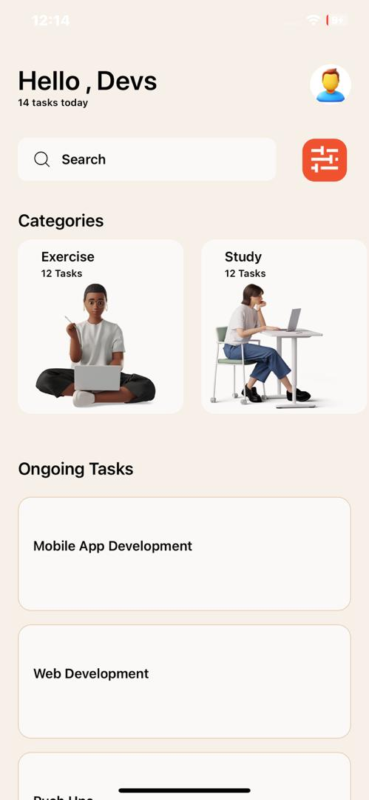

# rn-assignment3-11333063

## Project Description
This project is a mobile application developed using React Native and Expo.The app replicates the design provided in the UI mockup and includes core components and custom components.

## Components usage
1. App.js 
- This is the main entry point of the application. This is where the other components are set-up.
- Combines all components.

2. Category.jsx
- Custom component to render each category item.
- Displays category description,task count and image.

3. Task.jsx
- Custom component to render each task item.
- Displays task description.
 
4. Data
- Category.js
Contains the data for the category section.

- tasks.js
Contains the data for the task section.

5. styles
Contains the styles for the application

6. assets/images 
contains images of all used images.
## ScreenShots

## Student ID
11333063 (Akrong Adjei Naa Adjorkor)